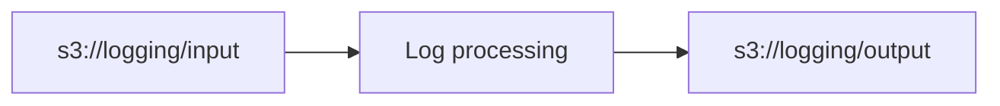

# Log processing system

Sistema serverless que recibe logs en batches (~1KB), los procesa con una
AWS Lambda y guarda el resultado como CSV en S3.



1. Un batch (`.log`) se sube a `s3://logging/input/`.
2. Esa escritura dispara la Lambda `log-processing` vía un S3 event trigger.
3. La Lambda descarga el batch, parsea cada línea y genera un CSV con las
   columnas `timestamp,hostname,program,pid,log`.
4. El CSV se sube a `s3://logging/output/` con el mismo nombre base que el
   `.log` original (p. ej. `openssh-1234567890.log` -> `openssh-1234567890.csv`).

## Dataset

Se usa el log de ejemplo de OpenSSH de [loghub](https://github.com/logpai/loghub/blob/master/OpenSSH/OpenSSH_2k.log)
(formato syslog):

```
Dec 10 06:55:46 LabSZ sshd[24200]: reverse mapping checking getaddrinfo for ns.marryaldkfaczcz.com [173.234.31.186] failed - POSSIBLE BREAK-IN ATTEMPT!
Dec 10 06:55:46 LabSZ sshd[24200]: Invalid user webmaster from 173.234.31.186
Dec 10 06:55:46 LabSZ sshd[24200]: input_userauth_request: invalid user webmaster [preauth]
```

## Estructura del proyecto

```
├── README.md
├── scripts
│   ├── package-lambda.sh    # empaqueta + despliega la Lambda y su rol IAM, conecta el trigger S3
│   ├── split-log.sh         # descarga el log y lo parte en batches de ~1KB: openssh-<timestamp>.log
│   ├── send-logs.sh         # sube los batches a s3://logging/input/ cada N segundos
│   ├── create-s3-bucket.sh  # crea el bucket "logging" con los prefijos input/ y output/
│   └── teardown.sh          # elimina todo lo creado (bucket, Lambda, rol IAM)
└── src
    └── logging-system
        ├── lambda_function.py  # handler: descarga .log, genera .csv, sube a output/
        └── requirements.txt
```

## Requisitos previos

- AWS CLI v2 configurado (`aws configure`) con credenciales que puedan
  crear buckets S3 y funciones Lambda.
- `python3`, `pip3` y `zip` instalados localmente (para empaquetar la Lambda).
- `curl` (usado por `split-log.sh` para descargar el log de ejemplo si no
  existe localmente).

El nombre de bucket `logging` es solo el default; como los nombres de
bucket en S3 son únicos globalmente, si ya está tomado pásalo como
argumento o exporta `BUCKET_NAME=tu-nombre-unico` antes de correr los
scripts (todos lo respetan).

### Rol IAM de la Lambda

`package-lambda.sh` intenta crear su propio rol IAM (`ROLE_NAME`, default
`log-processing-lambda-role`). En cuentas restringidas donde no se permite
`iam:CreateRole` (p. ej. **AWS Academy Learner Lab**, que usa `voclabs`),
el script cae automáticamente a un rol ya existente en la cuenta —
`FALLBACK_ROLE_NAME` (default `LabRole`, el rol estándar de AWS Academy).
`teardown.sh` nunca borra un rol que no haya creado él mismo (lo rastrea
con un marcador en `build/`), así que `LabRole` u otro rol compartido
siempre queda intacto.

### Trigger S3 -> Lambda

`package-lambda.sh` configura el trigger que pide el enunciado: una
notificación S3 -> Lambda directa (`s3api put-bucket-notification-configuration`
con `LambdaFunctionConfigurations`, más el permiso correspondiente vía
`lambda add-permission` para que S3 pueda invocar la función).

## Uso

```bash
# 1. Crear el bucket S3 "logging" con input/ y output/
./scripts/create-s3-bucket.sh

# 2. Partir el log de OpenSSH en batches de ~1KB
#    -> genera ./batches/openssh-<timestamp>.log
./scripts/split-log.sh

# 3. Empaquetar y desplegar la Lambda (crea rol IAM, función y el trigger S3)
./scripts/package-lambda.sh

# 4. Enviar los batches a s3://logging/input/, uno cada N segundos
./scripts/send-logs.sh 30

# Verificar los CSV generados
aws s3 ls s3://logging/output/

# 5. (Opcional) eliminar todos los recursos creados
./scripts/teardown.sh
```

Todos los scripts aceptan configuración por variables de entorno
(`BUCKET_NAME`, `FUNCTION_NAME`, `ROLE_NAME`, `AWS_REGION`); revisa el
encabezado de cada `.sh` para ver el detalle de uso y defaults.

## Formato de salida

Cada línea del `.log` de entrada, con formato syslog:

```
Mmm DD HH:MM:SS hostname programa[pid]: mensaje
```

se convierte en una fila del CSV de salida:

```csv
timestamp,hostname,program,pid,log
Dec 10 06:55:46,LabSZ,sshd,24200,Invalid user webmaster from 173.234.31.186
```

Si una línea no matchea el formato esperado no se descarta: se guarda con
las columnas de metadata vacías y el texto completo en `log`, y se deja un
warning en CloudWatch Logs para poder revisarla.

## Equipo

- Jose Pulido (jose.pulido@iteso.mx)
