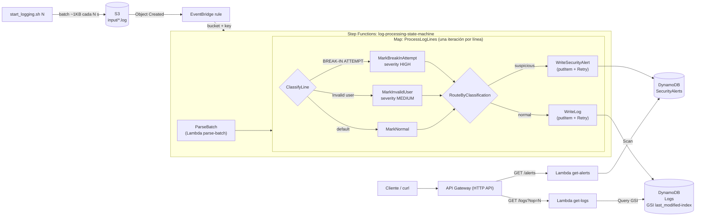

# Logging System (Práctica 2)

Sistema serverless que ingiere logs de servidores, los clasifica como
**normales** o **sospechosos** y expone los resultados mediante un HTTP API.

1. `start_logging.sh` parte el log de OpenSSH en batches de ~1KB y sube uno a
   S3 cada N segundos.
2. Cada batch que llega a `s3://<bucket>/input/*.log` dispara (vía EventBridge)
   una ejecución de Step Functions.
3. La Lambda `parse-batch` descarga el batch y lo separa en líneas.
4. Un estado **Map** recorre las líneas; dentro, un **Choice** clasifica cada
   una (sospechosa si contiene `Invalid user` o `POSSIBLE BREAK-IN ATTEMPT`) y
   otro **Choice** la dirige a `SecurityAlerts` o `Logs`. Las escrituras a
   DynamoDB tienen **Retry** con backoff exponencial para throttling.
5. API Gateway (HTTP API) expone `GET /alerts` y `GET /logs?top=N`, cada uno
   con su propia Lambda.

## Arquitectura



## Estructura del proyecto

```
├── OpenSSH_2k.log                   # log de ejemplo (se descarga solo si no existe)
├── scripts
│   ├── config.sh                    # nombres y defaults compartidos (lo cargan todos los scripts)
│   ├── deploy.sh                    # crea TODA la infraestructura (corre los 4 siguientes en orden)
│   ├── create-s3-bucket.sh          #   bucket S3 con prefijo input/
│   ├── create-dynamodb-table.sh     #   tablas Logs (con GSI last_modified-index) y SecurityAlerts
│   ├── deploy-state-machine.sh      #   Lambda parse-batch, Step Functions, regla EventBridge
│   ├── deploy-api.sh                #   Lambdas get-alerts / get-logs y HTTP API
│   ├── start_logging.sh             # parte el log en batches y los sube cada N segundos
│   ├── split-log.sh                 #   parte el log en batches de ~1KB (batches/openssh-<ts>-<n>.log)
│   ├── send-logs.sh                 #   sube los batches a S3 cada N segundos
│   ├── teardown.sh                  # elimina todo y verifica que no quede nada
│   └── package-lambda.sh            # Parte 2 (referencia histórica, ya no se usa)
└── src
    ├── parse-batch/                 # Lambda: descarga el batch y lo separa en líneas
    ├── get-alerts/                  # Lambda: GET /alerts
    ├── get-logs/                    # Lambda: GET /logs?top=N
    ├── step-functions/
    │   └── state-machine.asl.json   # definición ASL de la state machine
    └── logging-system/              # Parte 2 (referencia histórica, ya no se usa)
```

## Requisitos previos

- AWS CLI v2 configurado (`aws configure`) con permisos para S3, DynamoDB,
  Lambda, Step Functions, EventBridge, API Gateway e IAM.
- `bash`, `zip` y `curl`.

Los scripts crean sus propios roles IAM. En cuentas donde no se permite
`iam:CreateRole` (AWS Academy) usan automáticamente el rol existente
`LabRole`, y `teardown.sh` nunca borra un rol que no haya creado él mismo.

### Nombres de los recursos

Todos los nombres viven en [scripts/config.sh](scripts/config.sh) y se pueden
sobrescribir con variables de entorno. El único que tiene que ser único en
todo AWS es el bucket de S3, así que su nombre default lleva el account id:
`logging-bucket-<account_id>`. Así cada integrante puede desplegar en su
propia cuenta sin chocar con los demás. Los otros recursos (tablas, Lambdas,
state machine, roles, API) solo tienen que ser únicos dentro de una cuenta, así
que conservan nombres fijos (`Logs`, `SecurityAlerts`, `parse-batch`...).

### Desde WSL

El proyecto se ve en `/mnt/c`, y los scripts se invocan con `bash` porque
en esa ruta el bit de ejecución no siempre persiste (con
`chmod +x scripts/*.sh` puedes usar `./scripts/...`):

```bash
cd "/mnt/c/Users/<usuario>/Downloads/Desarrollo en la nube/lambda-test"
bash scripts/deploy.sh
```

Dos cosas que muerden:

- Si un script falla con `set: pipefail: invalid option name`, el archivo
  se guardó con finales de línea CRLF. Se arregla con
  `sed -i 's/\r$//' scripts/*.sh`.
- WSL tiene su propio `~/.aws`, así que hay que correr `aws configure`
  dentro de WSL. En AWS Academy hay que pegar ahí las tres líneas del
  Learner Lab (`aws_access_key_id`, `aws_secret_access_key` y
  `aws_session_token`), que expiran en cada sesión.

## Uso

### 1. Crear la infraestructura

```bash
./scripts/deploy.sh
```

Crea el bucket, las dos tablas, la Lambda `parse-batch`, la state machine, la
regla de EventBridge, las Lambdas `get-alerts` / `get-logs` y el HTTP API. Al
final imprime la URL del API (también queda en `build/api-endpoint.txt`). Es
idempotente: correrlo otra vez actualiza lo que ya existe.

### 2. Enviar logs

```bash
./scripts/start_logging.sh 30   # un batch cada 30 segundos
```

Cada subida dispara una ejecución de Step Functions.

> **Espera ~5 minutos después de `deploy.sh`.** En un bucket recién creado,
> S3 tarda unos minutos en empezar a mandar eventos a EventBridge (lo medimos:
> más de 4 minutos). Los batches que se suban antes llegan a S3 pero no
> disparan la state machine. Si pasa, basta con volver a subirlos.

**Tamaño de batch:** 1KB (1024 bytes). `split-log.sh` agrega líneas completas
hasta alcanzar o pasar 1024 bytes y entonces cierra el batch, así que cada
archivo mide entre 1024 y ~1190 bytes (8 a 12 líneas; el último batch es
más chico) y ninguna línea queda partida entre dos batches. Con
`OpenSSH_2k.log` salen 213 batches.

### 3. Consultar el API

```bash
API=$(cat build/api-endpoint.txt)
curl "$API/alerts"
curl "$API/logs?top=5"
```

`GET /alerts` regresa todas las alertas de `SecurityAlerts`, las más
recientes primero:

```json
{
  "count": 2,
  "alerts": [
    {"id": "openssh-1790032937-0004#00002", "timestamp": "Dec 10 06:55:46", "host": "LabSZ",
     "log": "Invalid user webmaster from 173.234.31.186", "severity": "MEDIUM"},
    {"id": "openssh-1790032937-0004#00001", "timestamp": "Dec 10 06:55:46", "host": "LabSZ",
     "log": "reverse mapping checking getaddrinfo for ns.marryaldkfaczcz.com [173.234.31.186] failed - POSSIBLE BREAK-IN ATTEMPT!",
     "severity": "HIGH"}
  ]
}
```

| severity | Cuándo                                    |
| -------- | ----------------------------------------- |
| `HIGH`   | La línea contiene `POSSIBLE BREAK-IN ATTEMPT` |
| `MEDIUM` | La línea contiene `Invalid user`          |

`GET /logs?top=N` regresa los últimos `N` logs de `Logs` (default 10, máximo
1000). No hace Scan: es un `Query` al GSI `last_modified-index` con
`Limit=N` y `ScanIndexForward=false`. Como todas las líneas de un batch
comparten el mismo `LastModified`, si el `Limit` corta a la mitad de un batch la
Lambda hace un segundo Query solo por ese `LastModified` y se queda con sus
líneas más recientes, para que el resultado sea exacto.

```json
{
  "top": 5, "count": 5,
  "logs": [
    {"id": "openssh-1790032937-0007#00004", "timestamp": "Dec 10 07:02:47", "host": "LabSZ",
     "log": "Received disconnect from 173.234.31.186: 11: Bye Bye [preauth]",
     "event_type": "disconnect", "last_modified": "2026-09-29T18:31:05Z"}
  ]
}
```

### 4. Ver el flujo en la consola de AWS

- **S3** > `logging-bucket-<account_id>` > `input/`: aparece un `.log` nuevo
  cada N segundos.
- **Step Functions** > `log-processing-state-machine` > **Executions** > la
  más reciente > **Graph view**: `ParseBatch` → `ProcessLogLines` (Map). Al
  seleccionar una iteración del Map se ve si pasó por `MarkBreakInAttempt`,
  `MarkInvalidUser` o `MarkNormal` y a qué tabla escribió.
- **DynamoDB** > `SecurityAlerts` / `Logs` > **Explore table items**: el
  número de items crece con cada batch. En `Logs` se puede hacer **Query**
  sobre el índice `last_modified-index` con `gsi_pk = LOG` y orden
  descendente, que es lo mismo que hace `GET /logs`.
- **API Gateway** > `logging-api` > **Routes**: `GET /alerts` y `GET /logs`,
  cada una con su integración Lambda.

### 5. Eliminar los recursos

```bash
./scripts/teardown.sh
```

Elimina el HTTP API, la regla de EventBridge, la state machine, las Lambdas
(y sus log groups de CloudWatch), los roles IAM que haya creado el proyecto,
las tablas, el bucket con su contenido y `build/`. Al final consulta cada
recurso y confirma que ya no existe:

```
== Verificación ==
  [ok] Bucket s3://logging-bucket-123456789012 eliminado
  [ok] Tabla DynamoDB Logs eliminado
  ...
Teardown completado: todos los recursos fueron eliminados.
```

**Limpieza manual** (si no se puede correr el script): en la consola borrar,
en este orden, el API `logging-api` (API Gateway), la regla
`s3-log-processing-rule` (EventBridge), la state machine
`log-processing-state-machine`, las Lambdas `parse-batch`, `get-alerts` y
`get-logs`, las tablas `Logs` y `SecurityAlerts`, y finalmente vaciar y borrar
el bucket `logging-bucket-<account_id>`.

## Modelo de datos

Un item por línea de log. Ambas tablas comparten el esquema base:

| Atributo           | Ejemplo                        | Notas                                         |
| ------------------ | ------------------------------ | --------------------------------------------- |
| `pk`               | `LabSZ#sshd`                   | Partition key: `<hostname>#<program>`         |
| `sk`               | `openssh-1790032937-0004#00007`     | Sort key: `<batch_id>#<línea>` (es el `id` del API) |
| `event_type`       | `invalid_user`                 | Partition key del GSI `event_type-index`      |
| `ingested_at`      | `2026-09-29T18:31:06Z`         | Hora en que se procesó; sort key de `event_type-index` |
| `last_modified`    | `2026-09-29T18:31:05Z`         | `LastModified` del batch en S3 (hora real de llegada) |
| `syslog_timestamp` | `Dec 10 06:55:46`              | La hora que trae el log                       |
| `hostname`         | `LabSZ`                        |                                               |
| `program` / `pid`  | `sshd` / `24200`               |                                               |
| `src_ip`           | `173.234.31.186`               | Vacío si la línea no trae IP                  |
| `message`          | `Invalid user webmaster from…` | El mensaje sin la metadata syslog             |

Solo en `SecurityAlerts`: `severity` (`HIGH` / `MEDIUM`).

Solo en `Logs`: `gsi_pk = "LOG"`, partition key fija del GSI
`last_modified-index` (sort key `last_modified`). Como todos los logs caen en
la misma partición del índice, ordenados por la hora en que llegó su batch,
"los últimos N" es un Query con `Limit=N` y `ScanIndexForward=false`.

La `sk` es determinista (batch + número de línea), así que si un batch se
reprocesa el item se sobrescribe en lugar de duplicarse.

## Decisiones de diseño

- **La Lambda solo parsea; Step Functions orquesta.** `parse-batch` descarga y
  separa el batch. La clasificación, el branching y la escritura son estados
  declarativos, visibles en el Graph view.
- **Escritura directa a DynamoDB** con `arn:aws:states:::dynamodb:putItem`: sin
  código intermedio ni Lambdas esperando I/O.
- **Retry para throttling** en `WriteLog` y `WriteSecurityAlert`:
  `ProvisionedThroughputExceededException`, `ThrottlingException`,
  `RequestLimitExceeded`, hasta 5 intentos con backoff exponencial ×2 y jitter.
  El Map limita su concurrencia a 10 para no generar ráfagas innecesarias.
- **S3 → EventBridge → Step Functions**: la regla filtra `input/*.log` y
  transforma el evento a `{"bucket", "key"}` sin código.
- **Tablas separadas**: `SecurityAlerts` aislada de `Logs` permite retención,
  alarmas y permisos distintos para los eventos sospechosos.

## Parte 2 (referencia histórica)

`scripts/package-lambda.sh` y `src/logging-system/` son la versión anterior,
en la que una sola Lambda con trigger directo de S3 escribía todo a la tabla
`log-events`. Se conservan solo como referencia; el flujo de Step Functions los
reemplaza y `deploy.sh` no los usa.

## Equipo

- Jose Pulido (jose.pulido@iteso.mx)
- David Paez (david.paez@iteso.mx)
- Gilberto Anaya (gilberto.anaya@iteso.mx)