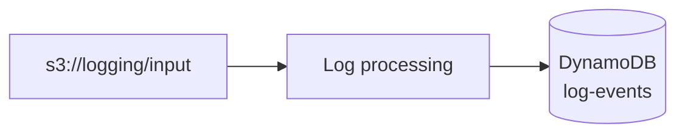
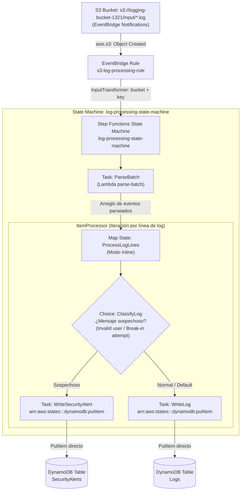

# Log processing system

Sistema serverless que recibe logs en batches (~1KB), los procesa con una
AWS Lambda y guarda cada línea como un item en DynamoDB.



1. Un batch (`.log`) se sube a `s3://logging/input/`.
2. Esa escritura dispara la Lambda `log-processing` vía un S3 event trigger.
3. La Lambda descarga el batch, parsea cada línea y la clasifica por
   `event_type` (`invalid_user`, `failed_password`, `break_in_attempt`...).
4. Escribe un item por línea en la tabla `log-events` con `BatchWriteItem`.

En la parte 1 la Lambda generaba un CSV y lo subía a `s3://logging/output/`;
ahora escribe directo a DynamoDB, así que ya no existe el prefijo `output/`.

## Dataset

Se usa el log de ejemplo de OpenSSH de [loghub](https://github.com/logpai/loghub/blob/master/OpenSSH/OpenSSH_2k.log)
(formato syslog):

```
Dec 10 06:55:46 LabSZ sshd[24200]: reverse mapping checking getaddrinfo for ns.marryaldkfaczcz.com [173.234.31.186] failed - POSSIBLE BREAK-IN ATTEMPT!
Dec 10 06:55:46 LabSZ sshd[24200]: Invalid user webmaster from 173.234.31.186
Dec 10 06:55:46 LabSZ sshd[24200]: input_userauth_request: invalid user webmaster [preauth]
```

## Estructura del proyecto

```
├── README.md
├── scripts
│   ├── create-s3-bucket.sh       # crea el bucket "logging" con el prefijo input/
│   ├── create-dynamodb-table.sh  # crea las tablas DynamoDB "Logs" y "SecurityAlerts" (y soporte para log-events)
│   ├── deploy-state-machine.sh   # Parte 3: empaqueta Lambda parse-batch, despliega State Machine y regla EventBridge
│   ├── package-lambda.sh         # Parte 2: empaqueta + despliega Lambda monolítica y trigger directo S3 (referencia)
│   ├── split-log.sh              # descarga el log y lo parte en batches de ~1KB: openssh-<timestamp>.log
│   ├── send-logs.sh              # sube los batches a s3://logging/input/ cada N segundos
│   └── teardown.sh               # elimina todo lo creado (Step Functions, EventBridge, Lambdas, tablas, bucket)
└── src
    ├── logging-system            # Parte 2: Lambda monolítica anterior (referencia histórica)
    │   ├── lambda_function.py
    │   └── requirements.txt
    ├── parse-batch               # Parte 3: Lambda enfocada exclusivamente en parsear el batch
    │   ├── lambda_function.py
    │   └── requirements.txt
    └── step-functions            # Parte 3: Definición ASL de la State Machine
        └── state-machine.asl.json
```

## Requisitos previos

- AWS CLI v2 configurado (`aws configure`) con credenciales que puedan crear
  buckets S3, tablas DynamoDB y funciones Lambda.
- `python3`, `pip3` y `zip` instalados localmente (para empaquetar la Lambda).
- `curl` (usado por `split-log.sh` para descargar el log de ejemplo si no
  existe localmente).

El nombre de bucket `logging-bucket-1321` es solo el default; como los
nombres de bucket en S3 son únicos globalmente, si ya está tomado exporta
`BUCKET_NAME=tu-nombre-unico` antes de correr los scripts (todos lo
respetan) y úsalo en todos los pasos. Lo mismo con `TABLE_NAME` (default
`log-events`), que `package-lambda.sh` le pasa a la Lambda como variable de
entorno.

`package-lambda.sh` crea su propio rol IAM (`log-processing-lambda-role`)
con permisos de lectura sobre `input/*` y de escritura en la tabla. En
cuentas restringidas donde no se permite `iam:CreateRole` (p. ej. AWS
Academy) usa automáticamente el rol existente `LabRole`, y `teardown.sh`
nunca borra un rol que no haya creado él mismo.

El trigger es una notificación S3 -> Lambda directa. Si falla al
configurarse desde la CLI, el script sigue e imprime el error para poder
crearla a mano: Bucket > Properties > Event notifications, prefijo
`input/`, sufijo `.log`, destino la función `log-processing`.

### Desde WSL

El proyecto se ve en `/mnt/c`, y los scripts se invocan con `bash` porque
en esa ruta el bit de ejecución no siempre persiste (con
`chmod +x scripts/*.sh` puedes usar `./scripts/...`):

```bash
cd "/mnt/c/Users/<usuario>/Downloads/Desarrollo en la nube/lambda-test"
bash scripts/create-s3-bucket.sh
```

Dos cosas que muerden:

- Si un script falla con `set: pipefail: invalid option name`, el archivo
  se guardó con finales de línea CRLF. Se arregla con
  `sed -i 's/\r$//' scripts/*.sh`.
- WSL tiene su propio `~/.aws`, así que hay que correr `aws configure`
  dentro de WSL. En AWS Academy hay que pegar ahí las tres líneas del
  Learner Lab (`aws_access_key_id`, `aws_secret_access_key` y
  `aws_session_token`), que expiran en cada sesión.

## Parte 3: Step Functions

En esta fase, la arquitectura evoluciona hacia una solución serverless desacoplada y orientada a eventos mediante **AWS Step Functions** y **Amazon EventBridge**.

> **Nota importante:**
> Este flujo basado en Step Functions **reemplaza por completo el trigger directo S3 -> Lambda de la parte 2**.
> Los scripts y código de la parte 2 (`scripts/package-lambda.sh` y `src/logging-system/`) se conservan exclusivamente como **referencia histórica de la evolución arquitectónica**, pero ya no se utilizan en producción una vez desplegado Step Functions.

### Diagrama del flujo



### ¿Por qué se separó `parse_batch` de la clasificación y escritura?

1. **Separación de responsabilidades (Single Responsibility Principle):**
   En la arquitectura anterior, una única Lambda monolítica descargaba el archivo, aplicaba expresiones regulares, evaluaba reglas de clasificación y realizaba llamadas de red a DynamoDB. Al separar `parse-batch`, la función Lambda se enfoca exclusivamente en descargar el archivo desde S3 y descomponer el texto en registros estructurados con regex. Toda la lógica de control de flujo, branching condicional y orquestación se delega al motor declarativo de Step Functions.
2. **Integraciones directas de Step Functions a DynamoDB (SDK Integrations sin código):**
   Step Functions se conecta directamente a DynamoDB mediante `arn:aws:states:::dynamodb:putItem`. Esto elimina la necesidad de código intermedio (*glue code*) en Python, reduce la superficie de bugs, evita reservar memoria y CPU en funciones Lambda para esperar I/O de red de base de datos, y disminuye los costos operativos de cómputo.
3. **Resiliencia declarativa y manejo de retries para throttling:**
   Cuando múltiples batches se procesan concurrentemente, pueden generarse ráfagas de escritura que excedan la capacidad o provoquen `ProvisionedThroughputExceededException` o `DynamoDB.AmazonDynamoDBException`. La máquina de estados gestiona reintentos exponenciales automáticos de forma nativa (`IntervalSeconds: 1`, `BackoffRate: 2.0`, `MaxAttempts: 3`), protegiendo el sistema contra pérdida de datos sin ensuciar la lógica de negocio con bucles de reintento manuales.
4. **Aislamiento físico y seguridad (Defense in Depth):**
   Separar los eventos anómalos o sospechosos (`*Invalid user*`, `*POSSIBLE BREAK-IN ATTEMPT*`) en una tabla dedicada `SecurityAlerts` aislada de `Logs` permite:
   - Auditar eventos críticos de seguridad con latencias mínimas y sin la sobrecarga de consultar millones de logs rutinarios.
   - Definir políticas de acceso IAM más estrictas sobre la tabla de seguridad.
   - Habilitar alarmas específicas o flujos de respuesta ante incidentes (por ejemplo, triggers secundarios hacia SNS o SIEM) únicamente sobre `SecurityAlerts`.
   - Establecer políticas de retención (TTL) diferenciadas para cada categoría de log.

### Instrucciones de uso paso a paso

#### 1. Crear las tablas DynamoDB (`Logs` y `SecurityAlerts`)
Crea ambas tablas en modo bajo demanda (`PAY_PER_REQUEST`) con sus índices secundarios globales (`event_type-index`):
```bash
./scripts/create-dynamodb-table.sh
```
*(Opcional: puedes personalizar los nombres definiendo `LOGS_TABLE_NAME` y `SECURITY_ALERTS_TABLE_NAME`)*.

#### 2. Desplegar la State Machine y componentes serverless
Ejecuta el script de despliegue automatizado:
```bash
./scripts/deploy-state-machine.sh
```
Este script realiza de forma idéntica y reproducible:
- El empaquetado y despliegue de la función Lambda `parse-batch`.
- La creación de los roles IAM requeridos (o conmutación automática a `LabRole` en entornos restringidos como AWS Academy).
- La creación o actualización de la State Machine `log-processing-state-machine` en Step Functions (inyectando ARNs y nombres de tabla en la definición ASL).
- La activación de notificaciones EventBridge en el bucket S3 (`put-bucket-notification-configuration`).
- La creación de la regla EventBridge `s3-log-processing-rule` con su target hacia la State Machine y transformación de parámetros (`InputTransformer`).

#### 3. Enviar logs hacia S3
Si no tienes los batches descargados y divididos, généralos primero:
```bash
./scripts/split-log.sh
```
Luego inicia la subida periódica de batches al prefijo `input/` de S3:
```bash
# Sube un batch cada 60 segundos
./scripts/send-logs.sh 60
```
Cada subida emitirá un evento en EventBridge que iniciará automáticamente una nueva ejecución en Step Functions.

#### 4. Revisar ejecuciones en Step Functions Console (Graph View)
1. En la consola de AWS, navega a **Step Functions** > **State machines** y haz clic en **`log-processing-state-machine`**.
2. En la pestaña **Executions**, selecciona la ejecución más reciente en la lista.
3. En la sección **Graph view**, observa el flujo visual:
   - El estado de tarea `ParseBatch` en verde, que extrae y entrega el arreglo de líneas a `ProcessLogLines`.
   - Haz clic sobre el estado `Map` (`ProcessLogLines`) para inspeccionar las ejecuciones concurrentes de cada registro del batch.
   - En el subflujo, visualiza cómo el estado `Choice` (`ClassifyLog`) bifurca cada ítem: los registros con intentos de intrusión o usuarios inválidos fluyen a `WriteSecurityAlert`, mientras que los logs normales fluyen a `WriteLog`.
4. En la pestaña **Execution input and output**, puedes validar el payload estructurado provisto por EventBridge (`{"bucket": "...", "key": "..."}`) y la salida del proceso.

#### 5. Consultar y verificar ambas tablas en DynamoDB Console
En la consola de AWS, navega a **DynamoDB** > **Tables**:
- **Tabla `SecurityAlerts`:**
  1. Selecciona **`SecurityAlerts`** > pestaña **Explore table items**.
  2. Verifica que solo contiene eventos clasificados como sospechosos (`break_in_attempt`, `invalid_user`).
  3. Cambia la opción a **Query**, selecciona el índice **`event_type-index`** y consulta con `event_type = break_in_attempt` para auditar intentos de intrusión ordenados temporalmente.
- **Tabla `Logs`:**
  1. Selecciona **`Logs`** > pestaña **Explore table items**.
  2. Comprueba que contiene los logs ordinarios (desconexiones, actividad de sshd regular, etc.).
  3. Realiza una **Query** en la tabla con la partition key `pk = LabSZ#sshd` y en la sort key `sk` la condición **Begins with** `openssh-` para ver todos los logs de un host o batch en particular.

#### 6. Limpieza de recursos (Teardown)
Cuando finalices la práctica o quieras limpiar la cuenta, ejecuta:
```bash
./scripts/teardown.sh
```
Este script elimina de manera segura:
- La regla EventBridge `s3-log-processing-rule` y su target `StepFunctionsTarget`.
- La State Machine `log-processing-state-machine` en Step Functions.
- Las funciones Lambda `parse-batch` y `log-processing`.
- Los roles IAM creados específicamente por el proyecto (verificados mediante marcadores en `build/`).
- Las tablas DynamoDB `Logs`, `SecurityAlerts` y `log-events`.
- El contenido del bucket S3 y el bucket en sí.
- Los artefactos temporales en `build/`.

---

## Parte 2 (Referencia histórica): Flujo S3 -> Lambda -> DynamoDB

> Esta sección documenta la arquitectura anterior de la Parte 2. Para el flujo de producción actual, consulta la [Parte 3: Step Functions](#parte-3-step-functions).

### Uso (Parte 2)

```bash
# 1. Crear el bucket S3 con el prefijo input/
./scripts/create-s3-bucket.sh

# 2. Crear la tabla DynamoDB "log-events"
./scripts/create-dynamodb-table.sh

# 3. Partir el log de OpenSSH en batches de ~1KB -> ./batches/openssh-<timestamp>.log
./scripts/split-log.sh

# 4. Empaquetar y desplegar la Lambda (rol IAM, función y trigger S3)
./scripts/package-lambda.sh

# 5. Enviar los batches a s3://logging/input/, uno cada 60 segundos
./scripts/send-logs.sh 60

# 6. (Opcional) eliminar todos los recursos creados
./scripts/teardown.sh
```

## Modelo de datos

Las tablas `Logs` y `SecurityAlerts` de la Parte 3 (al igual que la tabla `log-events` de la Parte 2) comparten la misma estructura de datos, un item por línea de log:

| Atributo           | Ejemplo                       | Notas                                 |
| ------------------ | ----------------------------- | ------------------------------------- |
| `pk`               | `LabSZ#sshd`                  | Partition key: `<hostname>#<program>` |
| `sk`               | `openssh-1789440570#00007`    | Sort key: `<batch_id>#<línea>`        |
| `event_type`       | `invalid_user`                | Partition key del GSI                 |
| `ingested_at`      | `2026-09-21T18:04:11Z`        | Sort key del GSI                      |
| `src_ip`           | `173.234.31.186`              | Solo si la línea trae IP              |
| `syslog_timestamp` | `Dec 10 06:55:46`             | La hora que trae el log               |
| `hostname`         | `LabSZ`                       |                                       |
| `program`          | `sshd`                        |                                       |
| `message`          | `Invalid user webmaster from…`| El mensaje sin la metadata syslog     |

La `sk` es determinista (batch + número de línea), así que si S3 vuelve a
disparar la Lambda con el mismo batch el item se sobrescribe en lugar de
duplicarse.

El GSI `event_type-index` permite consultar por tipo de evento con Query en
lugar de recorrer toda la tabla con Scan. Es GSI y no LSI porque su
partition key es distinta a la de la tabla.

## Validación

Con `./scripts/send-logs.sh 60` corriendo (un batch por minuto), todo se
puede seguir desde la consola de AWS.

**La query de la entrega.** DynamoDB > Tables > `log-events` > **Explore
table items**:

1. Selecciona **Query** y, en el selector de índice, **`event_type-index`**.
2. `event_type` = `invalid_user` > **Run**.
3. Espera al siguiente batch y vuelve a correr la misma query: el número de
   items crece porque están llegando logs nuevos.

**Los items de un batch en particular.** En la misma pantalla, Query sobre
la tabla (sin índice): `pk` = `LabSZ#sshd`, y en la sort key la condición
**Begins with** con `openssh-<timestamp>#`.

**El batch original.** S3 > `logging-bucket-1321` > `input/` > clic en el
`.log` > **Open**. Si el navegador no lo muestra, **Download**.

**Los logs de la Lambda.** CloudWatch > Log groups >
`/aws/lambda/log-processing`, con una línea por batch procesado.

## Equipo

- Jose Pulido (jose.pulido@iteso.mx)
