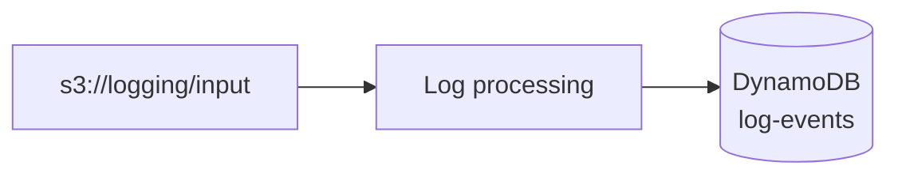

# Log processing system

Sistema serverless que recibe logs en batches (~1KB), los procesa con una
AWS Lambda y guarda cada línea como un item en DynamoDB.



1. Un batch (`.log`) se sube a `s3://logging/input/`.
2. Esa escritura dispara la Lambda `log-processing` vía un S3 event trigger.
3. La Lambda descarga el batch, parsea cada línea y la clasifica por
   `event_type` (`invalid_user`, `failed_password`, `break_in_attempt`...).
4. Escribe un item por línea en la tabla `log-events` con `BatchWriteItem`.

En la parte 1 la Lambda generaba un CSV y lo subía a `s3://logging/output/`;
ahora escribe directo a DynamoDB, así que ya no existe el prefijo `output/`.

## Dataset

Se usa el log de ejemplo de OpenSSH de [loghub](https://github.com/logpai/loghub/blob/master/OpenSSH/OpenSSH_2k.log)
(formato syslog):

```
Dec 10 06:55:46 LabSZ sshd[24200]: reverse mapping checking getaddrinfo for ns.marryaldkfaczcz.com [173.234.31.186] failed - POSSIBLE BREAK-IN ATTEMPT!
Dec 10 06:55:46 LabSZ sshd[24200]: Invalid user webmaster from 173.234.31.186
Dec 10 06:55:46 LabSZ sshd[24200]: input_userauth_request: invalid user webmaster [preauth]
```

## Estructura del proyecto

```
├── README.md
├── scripts
│   ├── create-s3-bucket.sh       # crea el bucket "logging" con el prefijo input/
│   ├── create-dynamodb-table.sh  # crea la tabla log-events y su GSI
│   ├── package-lambda.sh         # empaqueta + despliega la Lambda y su rol IAM, conecta el trigger S3
│   ├── split-log.sh              # descarga el log y lo parte en batches de ~1KB: openssh-<timestamp>.log
│   ├── send-logs.sh              # sube los batches a s3://logging/input/ cada N segundos
│   └── teardown.sh               # elimina todo lo creado (bucket, tabla, Lambda, rol IAM)
└── src
    └── logging-system
        ├── lambda_function.py    # handler: descarga el .log y escribe los items en DynamoDB
        └── requirements.txt
```

## Requisitos previos

- AWS CLI v2 configurado (`aws configure`) con credenciales que puedan crear
  buckets S3, tablas DynamoDB y funciones Lambda.
- `python3`, `pip3` y `zip` instalados localmente (para empaquetar la Lambda).
- `curl` (usado por `split-log.sh` para descargar el log de ejemplo si no
  existe localmente).

El nombre de bucket `logging-bucket-1321` es solo el default; como los
nombres de bucket en S3 son únicos globalmente, si ya está tomado exporta
`BUCKET_NAME=tu-nombre-unico` antes de correr los scripts (todos lo
respetan) y úsalo en todos los pasos. Lo mismo con `TABLE_NAME` (default
`log-events`), que `package-lambda.sh` le pasa a la Lambda como variable de
entorno.

`package-lambda.sh` crea su propio rol IAM (`log-processing-lambda-role`)
con permisos de lectura sobre `input/*` y de escritura en la tabla. En
cuentas restringidas donde no se permite `iam:CreateRole` (p. ej. AWS
Academy) usa automáticamente el rol existente `LabRole`, y `teardown.sh`
nunca borra un rol que no haya creado él mismo.

El trigger es una notificación S3 -> Lambda directa. Si falla al
configurarse desde la CLI, el script sigue e imprime el error para poder
crearla a mano: Bucket > Properties > Event notifications, prefijo
`input/`, sufijo `.log`, destino la función `log-processing`.

### Desde WSL

El proyecto se ve en `/mnt/c`, y los scripts se invocan con `bash` porque
en esa ruta el bit de ejecución no siempre persiste (con
`chmod +x scripts/*.sh` puedes usar `./scripts/...`):

```bash
cd "/mnt/c/Users/<usuario>/Downloads/Desarrollo en la nube/lambda-test"
bash scripts/create-s3-bucket.sh
```

Dos cosas que muerden:

- Si un script falla con `set: pipefail: invalid option name`, el archivo
  se guardó con finales de línea CRLF. Se arregla con
  `sed -i 's/\r$//' scripts/*.sh`.
- WSL tiene su propio `~/.aws`, así que hay que correr `aws configure`
  dentro de WSL. En AWS Academy hay que pegar ahí las tres líneas del
  Learner Lab (`aws_access_key_id`, `aws_secret_access_key` y
  `aws_session_token`), que expiran en cada sesión.

## Uso

```bash
# 1. Crear el bucket S3 con el prefijo input/
./scripts/create-s3-bucket.sh

# 2. Crear la tabla DynamoDB "log-events"
./scripts/create-dynamodb-table.sh

# 3. Partir el log de OpenSSH en batches de ~1KB -> ./batches/openssh-<timestamp>.log
./scripts/split-log.sh

# 4. Empaquetar y desplegar la Lambda (rol IAM, función y trigger S3)
./scripts/package-lambda.sh

# 5. Enviar los batches a s3://logging/input/, uno cada 60 segundos
./scripts/send-logs.sh 60

# 6. (Opcional) eliminar todos los recursos creados
./scripts/teardown.sh
```

## Modelo de datos

Tabla `log-events`, un item por línea de log:

| Atributo           | Ejemplo                       | Notas                                 |
| ------------------ | ----------------------------- | ------------------------------------- |
| `pk`               | `LabSZ#sshd`                  | Partition key: `<hostname>#<program>` |
| `sk`               | `openssh-1789440570#00007`    | Sort key: `<batch_id>#<línea>`        |
| `event_type`       | `invalid_user`                | Partition key del GSI                 |
| `ingested_at`      | `2026-09-21T18:04:11Z`        | Sort key del GSI                      |
| `src_ip`           | `173.234.31.186`              | Solo si la línea trae IP              |
| `syslog_timestamp` | `Dec 10 06:55:46`             | La hora que trae el log               |
| `hostname`         | `LabSZ`                       |                                       |
| `program`          | `sshd`                        |                                       |
| `message`          | `Invalid user webmaster from…`| El mensaje sin la metadata syslog     |

La `sk` es determinista (batch + número de línea), así que si S3 vuelve a
disparar la Lambda con el mismo batch el item se sobrescribe en lugar de
duplicarse.

El GSI `event_type-index` permite consultar por tipo de evento con Query en
lugar de recorrer toda la tabla con Scan. Es GSI y no LSI porque su
partition key es distinta a la de la tabla.

## Validación

Con `./scripts/send-logs.sh 60` corriendo (un batch por minuto), todo se
puede seguir desde la consola de AWS.

**La query de la entrega.** DynamoDB > Tables > `log-events` > **Explore
table items**:

1. Selecciona **Query** y, en el selector de índice, **`event_type-index`**.
2. `event_type` = `invalid_user` > **Run**.
3. Espera al siguiente batch y vuelve a correr la misma query: el número de
   items crece porque están llegando logs nuevos.

**Los items de un batch en particular.** En la misma pantalla, Query sobre
la tabla (sin índice): `pk` = `LabSZ#sshd`, y en la sort key la condición
**Begins with** con `openssh-<timestamp>#`.

**El batch original.** S3 > `logging-bucket-1321` > `input/` > clic en el
`.log` > **Open**. Si el navegador no lo muestra, **Download**.

**Los logs de la Lambda.** CloudWatch > Log groups >
`/aws/lambda/log-processing`, con una línea por batch procesado.

## Equipo

- Jose Pulido (jose.pulido@iteso.mx)
